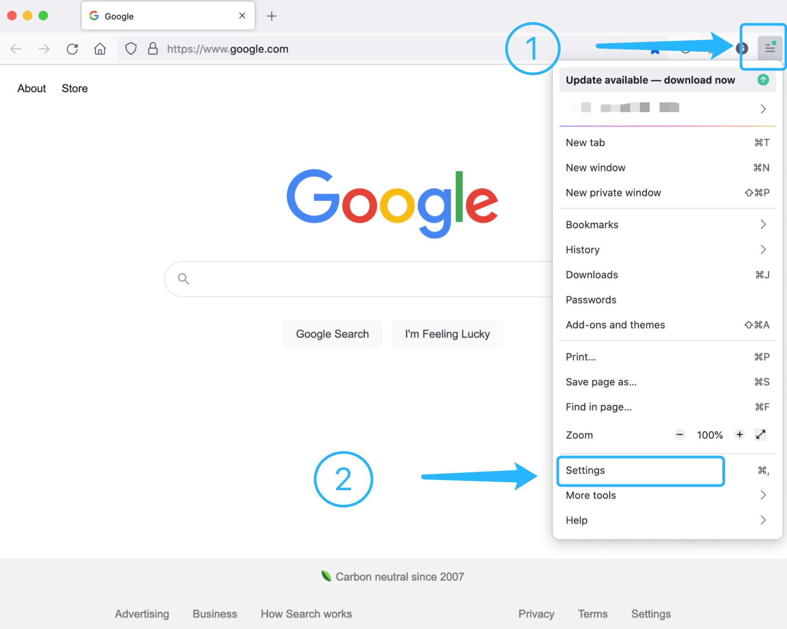
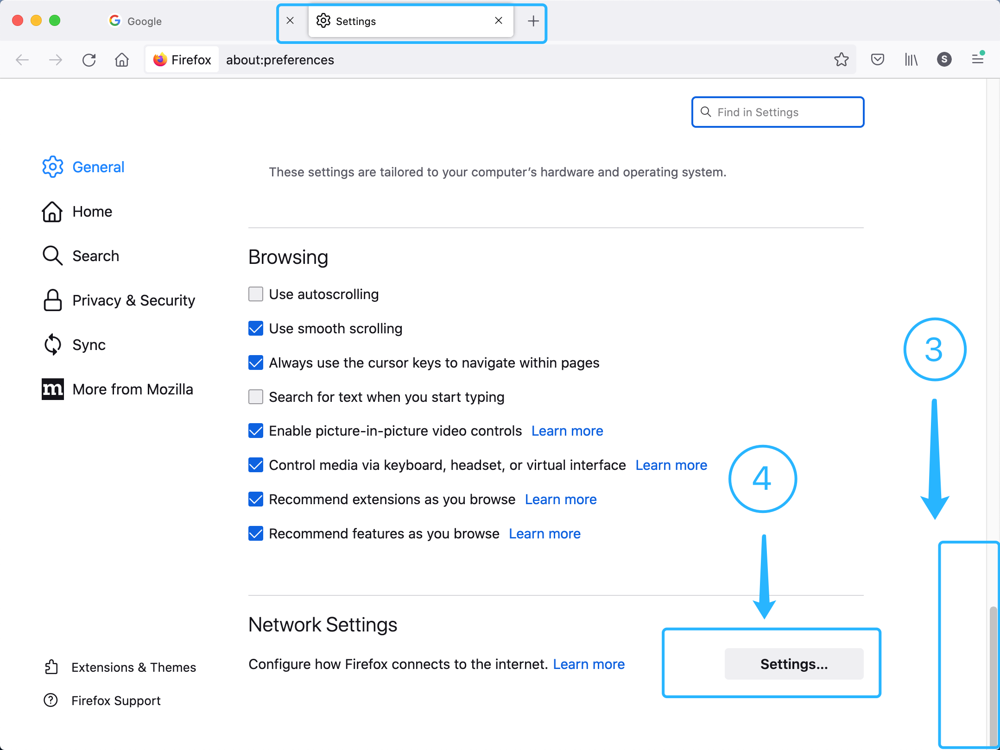
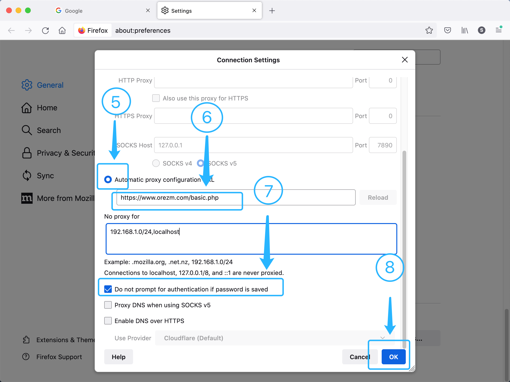

Project Orezm - User Guide
==========================

Welcome aboard. My name is Ernest, I’m a professional software engineer and solution expert, and I’ve been a developer for over 15 years. I’m here to help you get rid of internet restriction and censorships in case you are traveling or staying in mainland China. 

**Project Orezm** is not competing with those global leaders of the industry, such as Nord VPN and Express VPN. It’s just focusing on how to handle with the PRC’s weird network policy well, so than we can keep you out of being blocked by the GFW. If you're staying or planning to in China, then join this project would be your best choice.

Contents
--------

#. `Exclusive Features`_
#. `Get Started`_
#. `Links`_
#. `使用说明`_

..  _Exclusive Features:

Exclusive Features
------------------

#. Security & Speed Go First

We did not compromise on security and speed. Awesome VPN establishes connections with the same protocols as the other providers do. And all servers of Awesome VPN locate in southeast Asia, where is most close to mainland China. So we can keep your data and rate at the top tier.

#. Stability Matters

Awesome VPN will change inbound addresses automatically everyday. And connective test is running hourly. These will make your connection never get blocked.

#. It's a Car, Not a Bus

There will be no more than 10 users connecting to the same server at the same moment. You don't need to wait to get on even in the rush hour, and you will never be kicked out.

#. VPN and Proxy, You Got Both

We’re not going to kill a fly with an elephant gun. Our powerful proxy is suitable for most situations for connection speed and convenience reasons, though choice is on you.

#. Easy Use

No App or plugin needed. All you have to do is a few clicks on built-in settings of you cell phone or PC/Mac.

#. MOST IMPORTANT! It's Free of Charge.

Everyone can register and starts connections with no charge. They are just my every day personal use servers and I decide to share them with you guys. So just enjoy.

.. note::
    Of course, donation is very welcome. It really helps a lot to keeping this project alive. 
    to **Buy Me a Coffee**: `Click Here <https://www.buymeacoffee.com/orezm>`_

.. note::

    There are no limitations on rate and bandwidth of your subscription. So **the actual rate of connection mostly depends on which network you choose to connect to the server with**. If your Wi-Fi performs differently from hour to hour, always using cellphone network will bring you the best experience.

..  _Get Started:

Get Started
-----------

**Method 1: Settings for Firefox (Proxy for both Windows and Mac, MOST EASY WAY)**

#. Open Settings on Firefox Browser.

#. Click Settings in Network Settings section.

#. Check the option 'Automatically proxy configuration URL'

#. Copy and paste ``https://www.orezm.com/basic.php`` to the URL textbox.

#. Click OK. 

#. Figure 1

#. Figure 2

#. Figure 3

.. note::

    IP location can be changed by modifying the value of key 'node' in the URL above, like ``https://www.orezm.com/basic.php?node=default``. You can change 'default' to any location you prefered. Available nodes are listed in menu 'Servers' while you've login `HERE <https://www.orezm.com/wp-login.php>`_.

**Method 2: Settings for Cisco AnyConnect (VPN for Android, iPhone, Windows and Mac)**

#. Install and open Cisco AnyConnect Secure Mobility Client. You can get the install package from Google Play, Apple Store, Cisco Official Website, or just  `Click Here <https://github.com/orezm/avc/releases/tag/downloads>`_

#. `Click Here <https://www.orezm.com/wp-login.php>`_ and login, Click "Servers" on the left side menu.

#. Copy and paste one of the servers domain to the empty textbox on AnyConnect. 

#. Click Connect.

**Method 3: Set up a VPN connection on iPhone (No APP installed required)**

#. On iPhone, choose Settings > General > VPN, then click Add VPN Configuration.

#. Click the Type menu, then choose **IPSec**.

#. Enter the description as a name.

#. Enter the server address, the account name, and the password for the VPN connection.

#. Enter the secret which is the pre-shared key.

#. Click Done.

**Method 4: Set up a VPN connection on Mac (No Application installed required)**

#. On Mac, choose Apple menu > System Preferences, then click Network.

#. Click the Add button in the list at the left, click the Interface pop-up menu, then choose VPN.

#. Click the VPN Type pop-up menu, then choose **IPSec**. Give the VPN service a name, then click Create.

#. Enter the server address and the account name for the VPN connection.

#. Click Authentication Settings, then enter the Shared Key.

#. Select “Show VPN status in menu bar” to use the VPN status icon to connect to the network and switch between VPN services.

#. Click Apply.

..  _Links:

Links
-----

* `Project Orezm Homepage <https://www.orezm.com>`_

* `Sign Up <https://www.orezm.com/wp-login.php?action=register>`_

* `Login to User Page <https://www.orezm.com/wp-login.php>`_

* `Support or Become Member <https://www.buymeacoffee.com/orezm>`_

* `Pricing & Payment <https://www.orezm.com/my/payment/>`_

.. note::

    You should always click and open links above **WITHOUT** (or disconnect from) any VPN or Proxy connections.

..  _使用说明:

使用说明
-------

**方法一：简易使用说明（PAC方式）**

* 这是全网最简单的联网方式；按照本指引只需一步即可完成配置，无需下载软件或插件；
* 准备：请确保您的浏览器支持设置自定义代理，推荐下载并安装Firefox（火狐浏览器）；
* Firefox官网下载链接：`点击这里 <https://www.mozilla.org/zh-CN/firefox/>`_
* 操作步骤：

  * 第一步：打开Firefox浏览器，将下面链接复制到自动代理配置中，点击确定即可完成设置；
  * 没有第二步

.. code:: txt

  https://www.orezm.com/basic.php
  

* 详细说明：

  #. 打开Firefox，点击主菜单按钮并点击设置或首选项（见附图一）；
  #. 滚动至设置页面底部并点击“网络设置”右侧的设置按钮（见附图二）；
  #. 复制或输入PAC地址并点击确定（见附图三）；
  
* 完成设置后，即可通过Firefox访问国际互联网，其它应用仍保持原有联网方式，互不影响；
* PAC方式适用于电脑端（PC/Mac）的浏览器联网使用，如需手机使用请使用VPN方式联网；
* PAC为您的浏览器自动配置HTTPS代理服务器并使用SSL全程加密，因此您无须担心数据泄露；

* 附图1

* 附图2

* 附图3

**方法二：如何使用VPN方式进行联网**

* Awesome VPN的联网方式使用思科标准，因此同时适用于iOS, Android, Windows, Mac；
* 准备：下载并安装AnyConnect软件

  * iOS，可以从大陆App Store直接下载
  * 安卓，`点击下载 <https://github.com/orezm/avc/releases/download/downloads/AnyConnect.apk>`_
  * Mac，`点击下载 <https://github.com/orezm/avc/releases/download/downloads/anyconnect-macos-4.10.01075-predeploy-k9.dmg>`_
  * Windows，`点击下载 <https://github.com/orezm/avc/releases/download/downloads/anyconnect-win-4.10.01075-predeploy-k9.zip>`_

* 操作步骤：

  * 第一步：打开Project Orezm官网并登录，查看并复制您的AnyConnect专属连接地址；`点击这里登录 <https://www.orezm.com/wp-login.php>`_
  * 第二步：点击左侧菜单中的“Servers”, 选择并复制你准备连接的主机名（HOST）；
  * 第三步：打开AnyConnect软件，将主机名（HOST）填写连接地址，点击连接按钮；

* 下载AnyConnect软件时，请注意版本号不应低于7.10；
* 大陆的iOS的App Store可以直接下载到最新版本的AnyConnect；
* Google Play或三星应用商店可以直接下载到最新版本的AnyConnect；
* 大陆品牌的应用商店也可以获取AnyConnect，但应特别注意版本；

**方法三：如何使用Socks方式进行联网(暂不可用)**

* 仅限有经验的用户操作使用；
* 全程使用TLS加密，请务必确保您使用的客户端支持TLS连接；
* 推荐使用Clash客户端软件；
* 准备：下载并安装Clash：

  * Windows：Clash for Windows `点击下载 <https://github.com/orezm/avc/releases/download/downloads/anyconnect-win-4.10.01075-predeploy-k9.zip>`_
  * Mac：ClashX `点击下载 <https://github.com/orezm/avc/releases/download/downloads/ClashX.dmg>`_

* 操作步骤：

  * 第一步：打开Project Orezm官网并登录，查看并复制您的Socks专属连接地址；`点击这里登录 <https://www.orezm.com/my>`_
  * 第二步：下载Clash配置模板 `点击下载 <https://github.com/orezm/avc/releases/download/downloads/config.yaml>`_
  * 第三步：使用任意纯文本编辑软件打开配置模板；
  * 第四步：将<server>替换为您的Socks连接地址；
  * 第五步：将<username>替换为您的用户名；将<password>替换为您的密码；
  * 第六步：打开Clash for Windows或ClashX，导入配置文件；
  * 第七步：本地代理地址 127.0.0.1:7890
